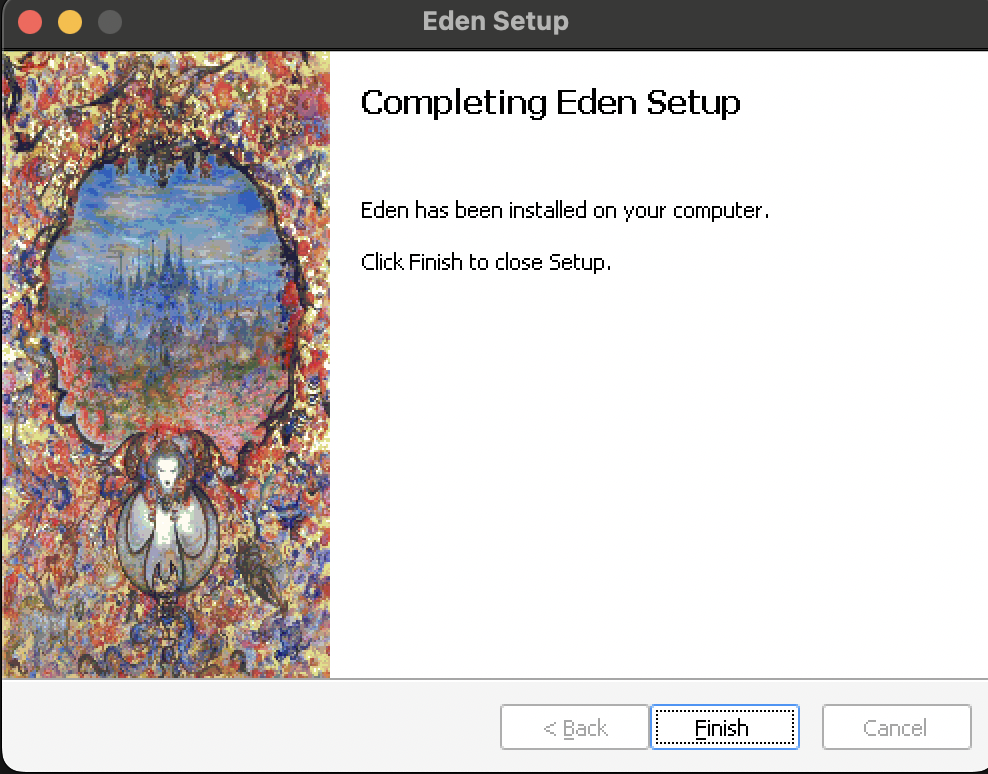

> Tested on MacMini M2 2023, Macbook Air M2 2022
 
> EdenXI Installation Guide Created By: @DungeonGoat
> - Discord: @DungeonGoat:7084
> - Instagram: https://www.instagram.com/dungeongoat/
> - FFXI: Dungeongoat, Hiddenmagik
> - Linkshell: Ragamuffins of Eden
> 	- Discord https://discord.gg/kpNDqZfd

> EdenXI 
> Website: https://edenxi.com
Discord: https://discord.com/invite/S3EAWr2Jec

## Index
1. [EdenXI Files](#1-edenxi-files)
2. [Homebrew Install](#2-homebrew-install)
3. [Whisky Install](#3-whisky-install)
4. [Whisky Configuration](#4-whisky-configuration)
5. [EdenXI Installation](#5-edenxi-installation)
6. [Whisky/EdenXI Pins Setup](#6-whiskyedenxi-pins-setup)
7. [Configure EdenXI Server Hairpin](#7-configure-edenxi-server-hairpin)
8. [EdenXI Window Configuration](#8-edenxi-window-configuration)
9. [Controller Configuration](#9-controller-configuration)
10. [Playing EdenXI](#10-playing-edenxi)
11. [Dual Boxing](#11-dual-boxing)

---

### 1. EdenXI Files
Go to: https://edenxi.com/install, Download the `Alternative Download` files.


>Note:

>This will open a Google Drive download.
>It will download as a .zip. It should auto-unzip.
>You should have `Installer.exe`, and `data.pak` files.
>

### 2. Homebrew Install
Using Terminal: Install Homebrew:  https://brew.sh
``` Terminal
/bin/bash -c "$(curl -fsSL https://raw.githubusercontent.com/Homebrew/install/HEAD/install.sh)"
```

Press ENTER to continue and agree to the XCode license.


>Note:
>Homebrew may ask you to accept an XCode license agreement:
>Use this command in the Terminal to accept: 
>``` Terminal
>sudo xcodebuild -license accept
>```

>Note:
>If you already have Homebrew installed, be sure to `brew update`

### 3. Whisky Install
Using Terminal: Install Whisky: https://github.com/Whisky-App/Whisky
``` Terminal
brew install --cask whisky
```


Open Whisky with either:
	1. Finder -> Applications -> Whisky
	2. Spotlight: CMD + Space -> type Whisky


> Note:
> Click `Open` if this dialogue pops up.


Click Next to install dependencies.


### 4. Whisky Configuration
1. Click Create Bottle


2. Set the follow settings, then press Create. This may take a while to complete.
Bottle Name: EdenXI
Windows Version: Windows 10
Bottle Path: Leave as default


3. Click Winetricks


4. Click DLLs -> `dotnet40` -> Run


Allow if asked.


Check the ToS and Install. This may come up a few times and takes a while to complete.


### 5. EdenXI Installation
Click Run -> Select Installer.exe from the EdenXI download.


Allow if asked.


Click Continue on the Eden Installer.


Accept the ToS


You will see popups as it verifies the dotnet runtime.


This may take a while.


It should auto-progress to the Install Location when dotnet is done.
Leave the installation at `C:\Eden`, click Install


Wait for the installer to finish


Click Finish


Verify your folder structure has `Eden` at the root of C:\


### 6. Whisky/EdenXI Pins Setup
> Note: If you see Ashita pinned, right click and Unpin it.
> 

1. Create a Pin called `Config`
- Click the + button to create a new pin called `Config`
- Click Browse and navigate to `Eden/Square Enix/FINAL FANTASY XI/ToolsUS/FINAL FANTASY XI Config.exe`
- Click Pin to confirm.


> Note:
> Click the Refresh symbol to refresh the Whisky UI and show the icons. 

2. Create a Pin called `Controller Config`
- Click the + button to create a new pin called `Controller Config`
- Click Browse and navigate to `Eden/Square Enix/FINAL FANTASY XI/ToolsUS/FINAL FFXiPadConfig.exe`
- Click Pin to confirm.


3. Create a Pin called `EdenXI`
- Click the + button to create a new pin called `EdenXI`
- Click Browse and navigate to `Eden/Ashita/ffxi-bootmod/xiloader.exe`
- Click Pin to confirm.


You should end up with these 3 pins.


### 7. Configure EdenXI Server Hairpin

Right click the `EdenXI` pin and click `Config` 


Add to the arguments: `--server play.edenxi.com --hairpin`
(This tells the launcher to connect to the EdenXI server)
Then click the Back Arrow.


### 8. EdenXI Window Configuration

Right click and Run the pinned Config


Change the window mode to `Windowed mode`
> Note: Full Screen mode is not supported.


Adjust screen size as desired in the Screen Size tab.


Click OK and say Yes to save the settings.


### 9. Controller Configuration
Right Click > Run the Controller Config pin


Check the Enable Gamepad box


Click Test Gamepad and confirm your controller works.
Click OK and save changes.


### 10. Playing EdenXI
1. Right Click the EdenXI pin and click Run


The Terminal will open with some options.
If you see this, you're on the right path. Otherwise, you messed up somewhere.


2. Select to create an account or login.

Once logged in the game will launch:


> Note: The audio may be janky.

### 11. Dual Boxing
The current solution to dualboxing is simply creating a second Bottle in Whisky, following all the above steps, and running both instances of EdenXI.

It is recommended to use the same character on the same Bottle every time, otherwise you may lose Macros.


